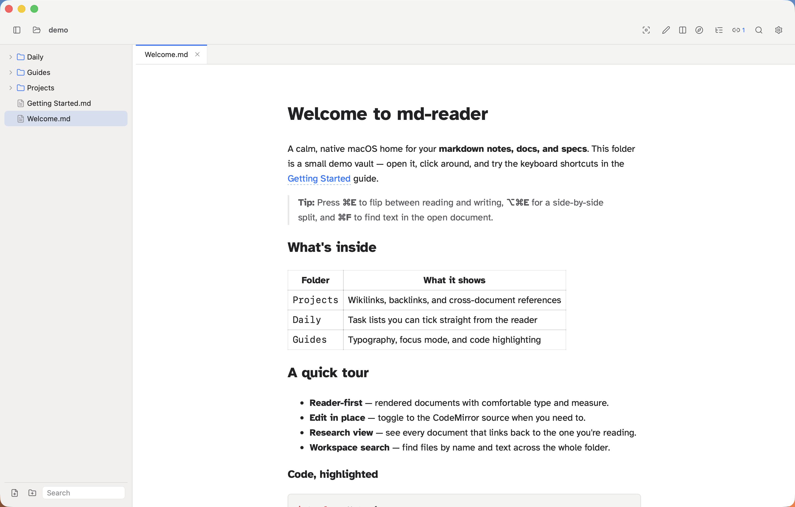
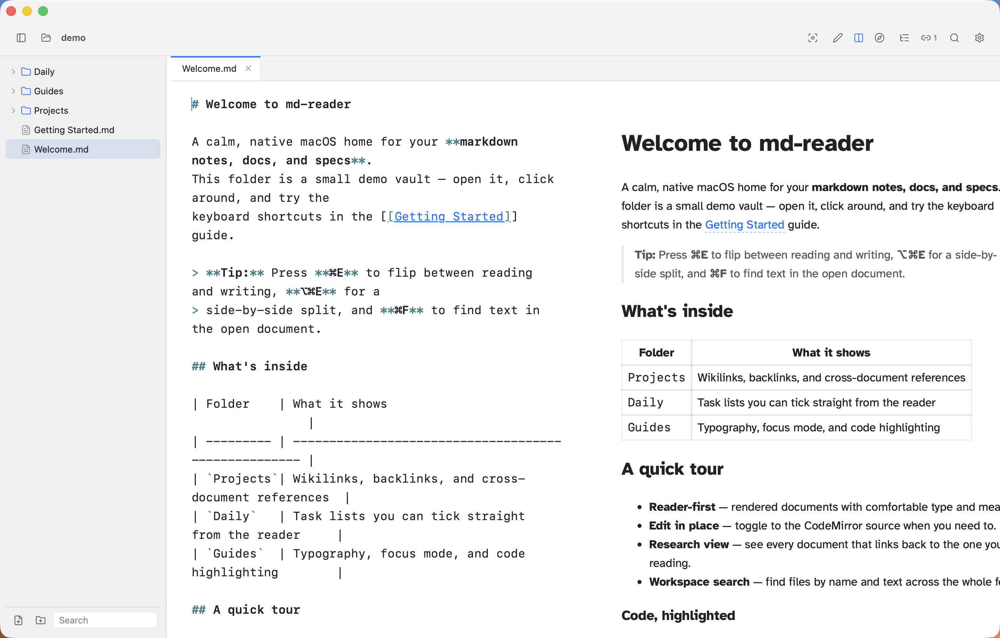
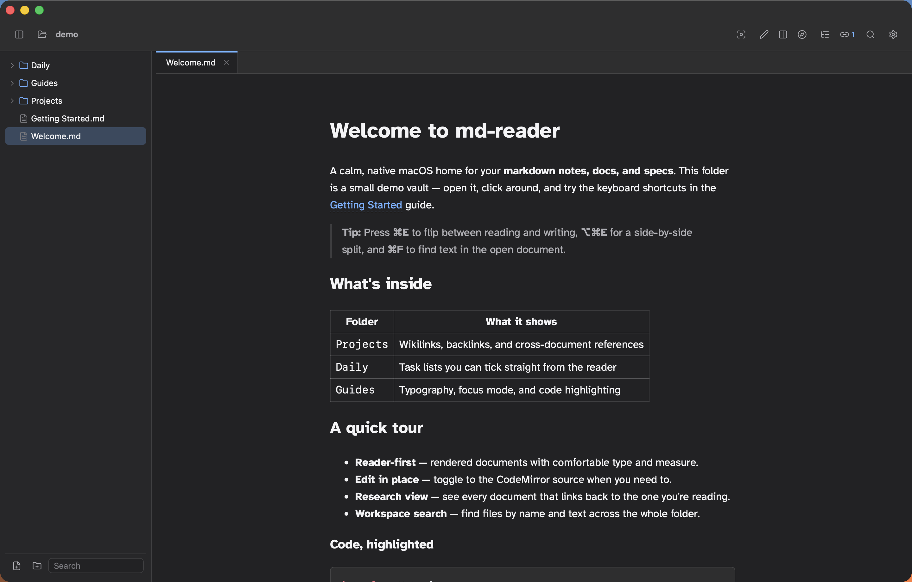

# md-reader

**A calm, native macOS markdown reader for your notes, docs, and knowledge base.**
Local-first, zero telemetry, no database — just your `.md` files.

[](https://github.com/olafkrawczyk/md-reader/releases/latest)
[](LICENSE)
[](https://github.com/olafkrawczyk/md-reader/releases/latest)



## Why md-reader

Most markdown apps make you choose between a code editor that treats prose as text, or a note-taking app that locks your writing inside a database. md-reader is built for the other thing: reading.

- **Reader-first** — rendered documents with real typographic controls: font, size, line height, measure, text tint, focus mode, and bionic reading.
- **Edit in place** — flip to the CodeMirror source with `⌘E`, or work side by side with `⌥⌘E`.
- **Navigate like a wiki, store like a folder** — `[[wikilinks]]` and context-aware backlinks, resolved from the filesystem with no index database.
- **Fast on real vaults** — a native Rust workspace walk with a configurable ignore list, plus workspace-wide search.

Everything stays on your machine. No accounts, no sync, no analytics.

## Features

- **Read & write** — CommonMark + GFM (tables, task lists, strikethrough) and Shiki-powered syntax highlighting.
- **Layouts** — Read, Write, Split, and Research presets from the toolbar or keyboard.
- **Research view** — every document that links back to the one you're reading.
- **Document outline** — jump between headings without leaving the note.
- **Workspace search** — find documents by name and text across the folder.
- **Interactive tasks** — click a `- [ ]` checkbox in the reader and the source updates.
- **Preview tabs** — browse with single clicks, keep a tab with a double click.
- **Autosave + close guard** — nothing is lost on `⌘W` or quit.
- **Full file management** — create, rename, move, copy, and delete from the sidebar.
- **Themes** — Light, Dark, and Auto, applied instantly.

Side-by-side editing as you type:



Dark mode:



## Install

Download the latest `.dmg` from the [releases page](https://github.com/olafkrawczyk/md-reader/releases/latest), open it, and drag **md-reader** into your Applications folder.

> **Requires macOS on Apple Silicon (M-series).** The app is currently unsigned, so Gatekeeper will warn on first launch. To open it, either **right-click the app → Open → Open**, or clear the quarantine flag:
>
> ```sh
> xattr -dr com.apple.quarantine /Applications/md-reader.app
> ```

Prefer to install from source? See [Build from source](#build-from-source).

## Try it

The repo ships a small demo vault in [`docs/demo/`](docs/demo) with wikilinks, backlinks, task lists, tables, and code blocks. Point the app at it:

```sh
md-reader docs/demo
```

## Command line

```sh
md-reader                 # open the app, or focus a running instance
md-reader <path>          # open a file (with its folder) or a whole folder
md-reader --help
```

## Keyboard shortcuts

| Keys        | Action                          |
| ----------- | ------------------------------- |
| `⌘O`        | Open folder                     |
| `⌘S`        | Save document                   |
| `⌘E`        | Toggle reader / editor          |
| `⌥⌘E`       | Toggle side-by-side split       |
| `⌘F`        | Find in document                |
| `⌘N`        | New file                        |
| `⌘⇧N`       | New folder                      |
| `⌘←` / `⌘→` | Previous / next tab             |
| `⌃Tab`      | Next tab (`⌃⇧Tab` for previous) |
| `⌘W`        | Close tab                       |

## Build from source

Prerequisites: [Node.js](https://nodejs.org) 22+, the [Rust toolchain](https://rustup.rs), and Xcode Command Line Tools.

```sh
npm install
npm run dev          # run with hot reload
npm run build:app    # produce a release .app and .dmg
npm run install:app  # copy the bundle to /Applications and link the CLI
```

The built bundle lands at `src-tauri/target/release/bundle/`.

## Architecture

md-reader is a Tauri 2 app: a Rust core for the filesystem, workspace watching, and native menus, and a React + CodeMirror front end.

Every product feature ships through an **extension platform** — a manifest-driven host with a typed service registry, transformer pipelines, pane registration, and schema-driven settings. The built-in features (markdown, GFM, Shiki, reader, editor, explorer, links, outline, search, themes, file management) are all extensions, so the core stays small and new surfaces can be added without touching it.

The spec-driven development history lives in [`openspec/`](openspec).

## License

[MIT](LICENSE) © Olaf Krawczyk
