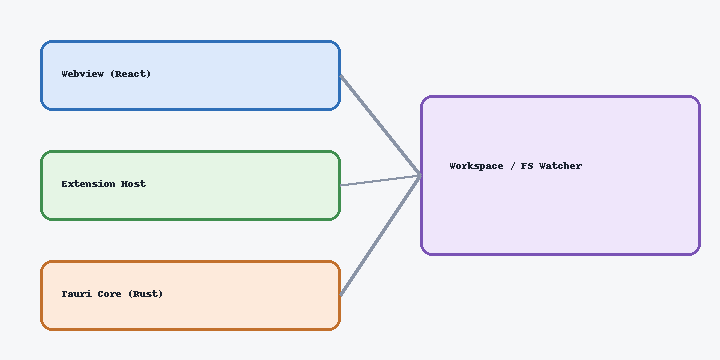
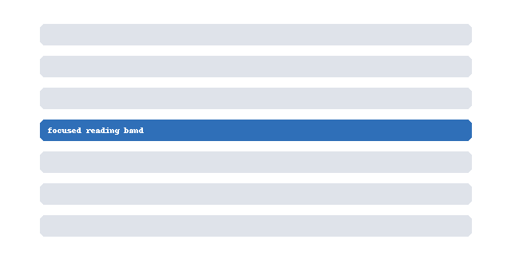

# Guide: images from a subfolder

This file lives in `sample/guides/`, so it reaches the shared image folder by
climbing one level with `../`.

## Parent-relative path

## Another one

Both of the above use `../images/...`. If these render here but break in
[[images]], the difference is the `..` segment handling — not the asset scope.

Back to [[README]].
