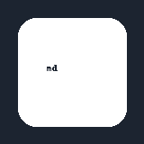
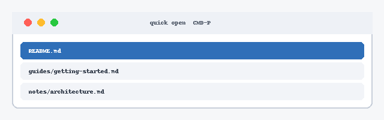

# Images

Local images resolve relative to **this document's folder** and are served
through the Tauri asset protocol, which is scoped to the workspace root.

## Same-folder relative path

The app logo, referenced as `./images/logo.png`:

## Without the leading `./`

The same file, written as `images/quick-open.png`:

## A wider diagram

## Focus mode

One band stays legible while the rest dims:

## Remote and inline sources are left alone

A remote image is passed through untouched (it will only load when online):

An inline `data:` URI is also untouched:

## A missing image still renders as a broken image, not a crash

See also [[notes/architecture]] and [[README]].
